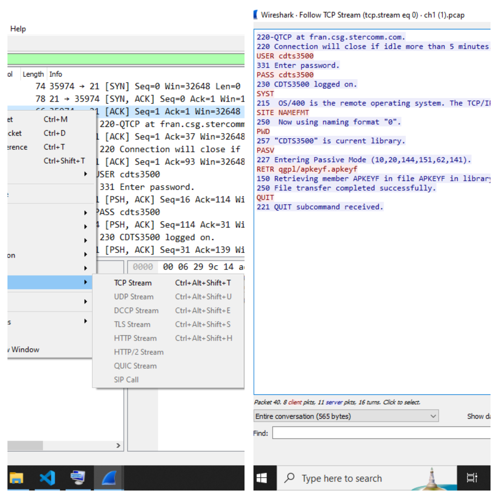
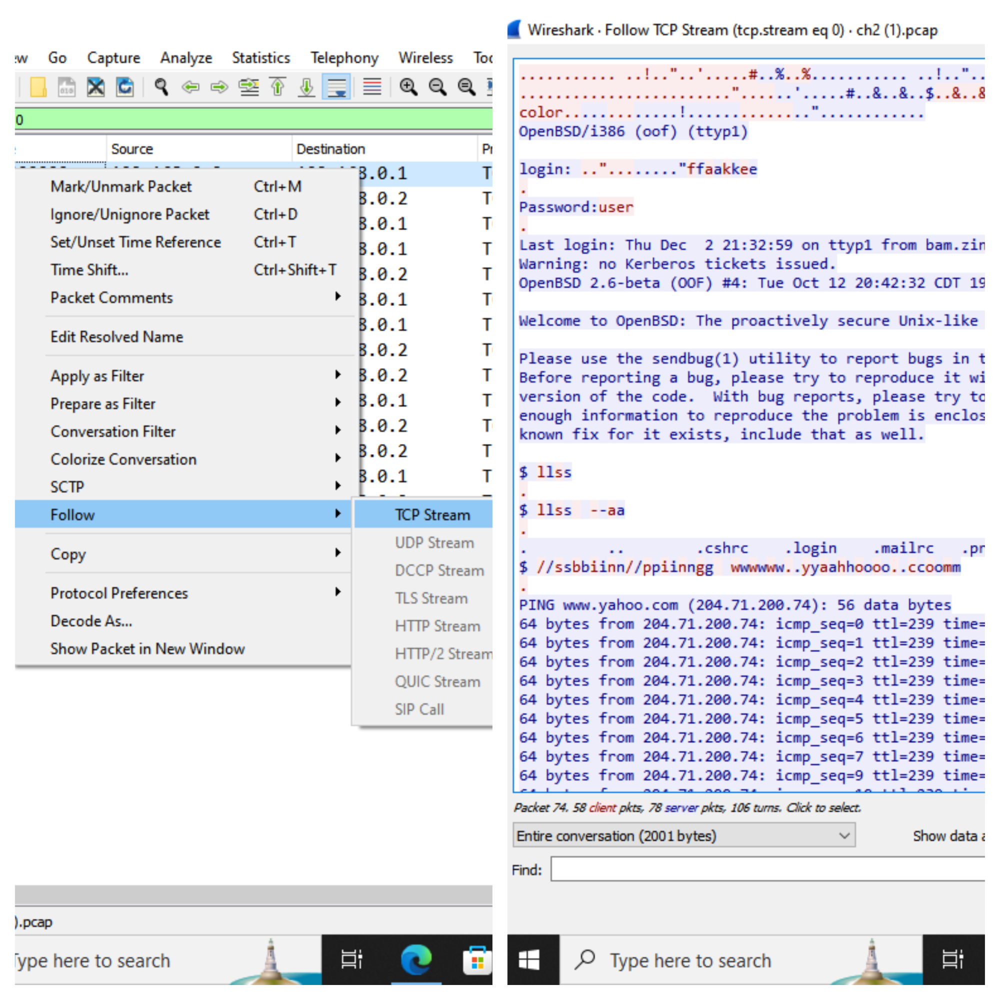
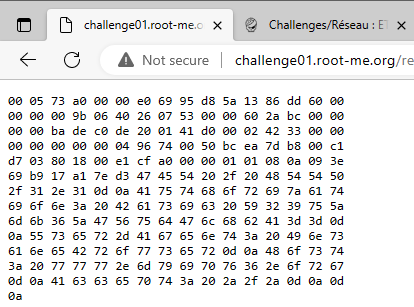
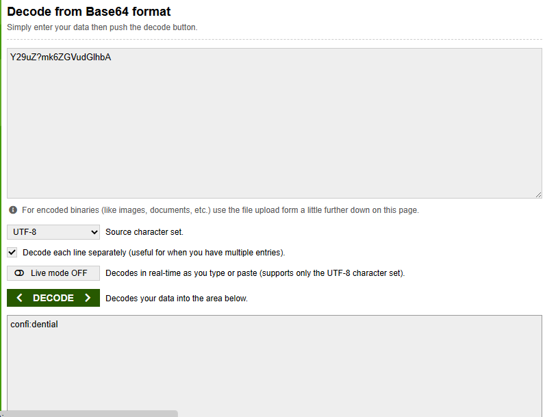
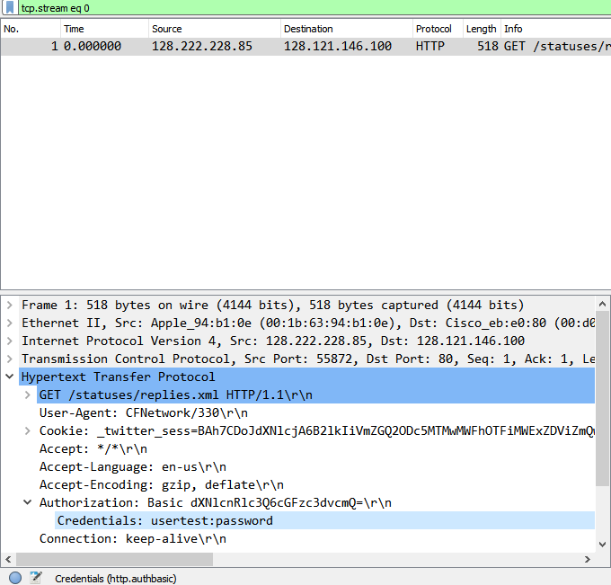
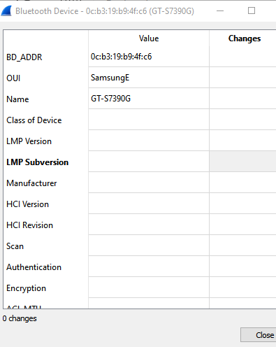
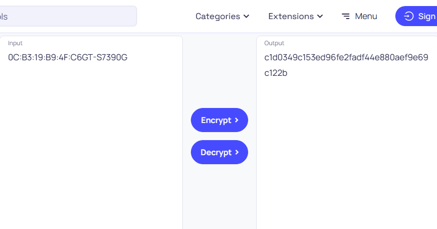
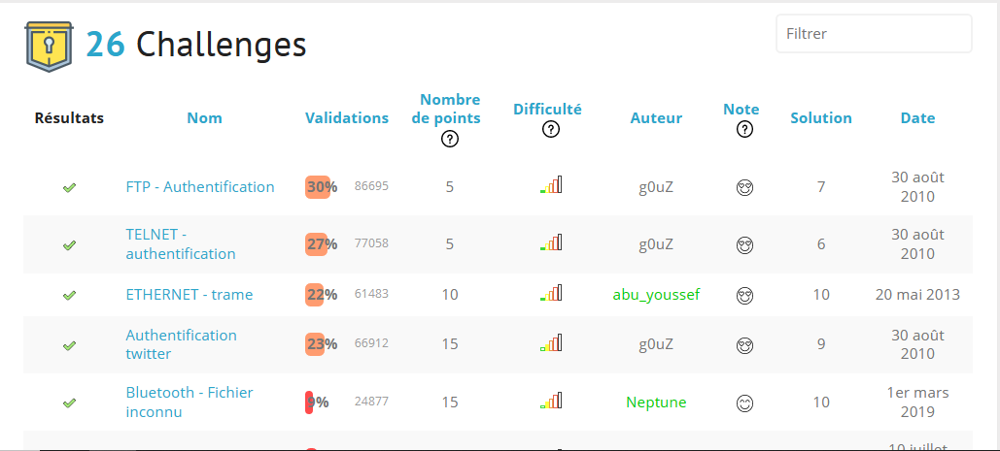

# SOLUTION LEVEL ROOT ME 

# FTP Authentification :
## Etape:
### 1 - Telecharger le sujet .
### 2 - Ouvrez le fichier sur Wirashark (Nom du dossier : ch1.pcap) .
### 3 - Rechecher sur le bar de recherche ==> telnet .
### 4 - Faire click droite sur le flux TCP , follow , TCP stream  ==> solution de nos challenge .

# TELNET Authentification :
## Etape:
### 1 - Telecharger le sujet .
### 2 - Ouvrez le fichier sur Wirashark (Nom du dossier : ch2.pcap) .
### 3 - Rechecher sur le bar de recherche ==> telnet .
### 4 - Faire click droite sur le flux TCP , follow , TCP stream  ==> solution de nos challenge .

# Twitter Authentification:
## Etape:
### 1 - Telecharger le sujet .

### 2 - Decode les Hex dans le fichier et convertir en String.

### 3 - Decode le mot de passe qui a de base 64  .

# ETHERNET Trame :
## Etape:
### 1 - Telecharger le sujet .
### 2 - Ouvrez le fichier sur Wirashark (Nom du dossier : ch3.pcap) .
### 3 - Faire click  sur "Hypertext Transfer Protocol" puis "Authorization"  ==> solution de nos challenge .

# BLUETOOTH - Fichier inconnu (à faire même si cela n'a pas été fait lors de la séance de ce jour) :
## Etape:
### 1 - Telecharger le sujet .
### 2 - Ouvrez le fichier sur Wirashark .
### 3 - Click sur Wireless puis Bluetooth Devices.

### Encript le hash SHA1 de la concaténation de l’adresse MAC (en majuscules) et du nom du téléphone .

# Les challengs réuissie :
